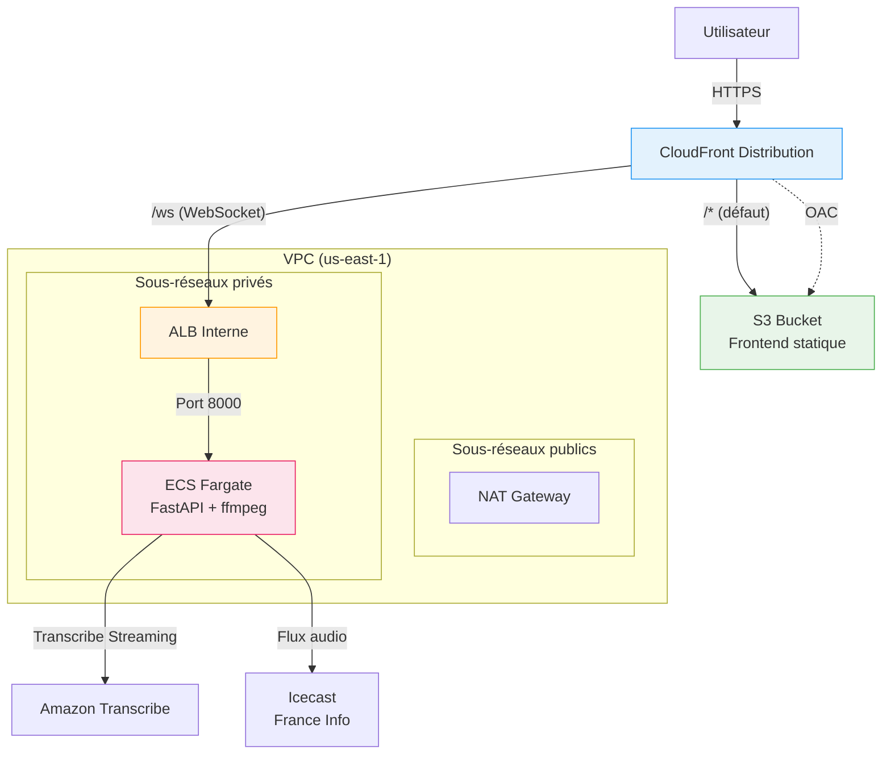

# Document de Design — Déploiement AWS

## Vue d'ensemble

Ce design décrit l'infrastructure AWS CDK (Python) pour déployer l'application de transcription en temps réel de France Info. L'architecture suit un modèle classique frontend/backend découplé :

- Le frontend statique (`index.html`) est hébergé dans un bucket S3 privé, accessible uniquement via CloudFront avec OAC
- Le backend (FastAPI + ffmpeg + Amazon Transcribe Streaming) tourne dans un conteneur Docker sur ECS Fargate, derrière un ALB interne
- CloudFront sert de point d'entrée unique : les requêtes statiques vont vers S3, les connexions WebSocket (`/ws`) sont routées vers l'ALB

Cette architecture garantit qu'aucune ressource n'est directement exposée sur Internet, conformément à la politique de sécurité zéro accès public.

## Architecture



### Flux de données

1. L'utilisateur accède à l'URL CloudFront
2. CloudFront sert `index.html` depuis S3 (comportement par défaut via OAC)
3. Le JavaScript du frontend ouvre une connexion WebSocket vers `wss://<cloudfront-domain>/ws`
4. CloudFront route `/ws` vers l'ALB interne
5. L'ALB forward vers le conteneur ECS Fargate sur le port 8000
6. Le conteneur capture le flux Icecast via ffmpeg, envoie l'audio à Transcribe Streaming, et diffuse les résultats via WebSocket

## Composants et Interfaces

### 1. Stack CDK principal (`TranscriptionAppStack`)

Le stack CDK unique qui orchestre toutes les ressources. Implémenté dans un fichier `infra/transcription_stack.py`.

```python
class TranscriptionAppStack(Stack):
    def __init__(self, scope: Construct, construct_id: str, **kwargs):
        super().__init__(scope, construct_id, **kwargs)
        # 1. VPC
        # 2. S3 Bucket + déploiement frontend
        # 3. ECS Cluster + Task Definition + Service
        # 4. ALB interne
        # 5. CloudFront Distribution
        # 6. Outputs
```

### 2. VPC

```python
vpc = ec2.Vpc(
    self, "TranscriptionVpc",
    max_azs=2,
    nat_gateways=1,
    subnet_configuration=[
        ec2.SubnetConfiguration(
            name="Public",
            subnet_type=ec2.SubnetType.PUBLIC,
            cidr_mask=24,
        ),
        ec2.SubnetConfiguration(
            name="Private",
            subnet_type=ec2.SubnetType.PRIVATE_WITH_EGRESS,
            cidr_mask=24,
        ),
    ],
)
```

Décisions de design :
- 2 AZ pour la haute disponibilité
- 1 NAT Gateway (compromis coût/disponibilité pour un projet non-critique)
- Sous-réseaux privés avec egress pour que les tâches ECS accèdent à Icecast et Transcribe

### 3. S3 Bucket (Frontend)

```python
frontend_bucket = s3.Bucket(
    self, "FrontendBucket",
    block_public_access=s3.BlockPublicAccess.BLOCK_ALL,
    public_read_access=False,
    encryption=s3.BucketEncryption.S3_MANAGED,
    removal_policy=RemovalPolicy.DESTROY,
    auto_delete_objects=True,
)
```

Le déploiement des fichiers statiques utilise `BucketDeployment` :

```python
s3deploy.BucketDeployment(
    self, "DeployFrontend",
    sources=[s3deploy.Source.asset("./static")],
    destination_bucket=frontend_bucket,
)
```

### 4. ECS Fargate (Backend)

#### Dockerfile

```dockerfile
FROM python:3.13-slim

RUN apt-get update && apt-get install -y --no-install-recommends \
    ffmpeg \
    && rm -rf /var/lib/apt/lists/*

WORKDIR /app

COPY requirements.txt .
RUN pip install --no-cache-dir -r requirements.txt

COPY app.py messages.py session_manager.py transcription_session.py ./

EXPOSE 8000

CMD ["uvicorn", "app:app", "--host", "0.0.0.0", "--port", "8000"]
```

#### Task Definition et Service

```python
task_definition = ecs.FargateTaskDefinition(
    self, "TaskDef",
    memory_limit_mib=512,
    cpu=256,
)

# Permission Transcribe
task_definition.add_to_task_role_policy(
    iam.PolicyStatement(
        actions=["transcribe:StartStreamTranscription"],
        resources=["*"],
    )
)

container = task_definition.add_container(
    "TranscriptionContainer",
    image=ecs.ContainerImage.from_asset("."),
    logging=ecs.LogDrivers.aws_logs(stream_prefix="transcription"),
    port_mappings=[ecs.PortMapping(container_port=8000)],
)
```

Décisions de design :
- 256 CPU / 512 MiB mémoire : suffisant pour FastAPI + ffmpeg + un flux audio
- Logs CloudWatch pour le monitoring
- L'image Docker est construite depuis la racine du projet via `from_asset(".")`

### 5. ALB Interne

```python
alb = elbv2.ApplicationLoadBalancer(
    self, "InternalALB",
    vpc=vpc,
    internet_facing=False,  # CRITIQUE : interne uniquement
    vpc_subnets=ec2.SubnetSelection(subnet_type=ec2.SubnetType.PRIVATE_WITH_EGRESS),
)

listener = alb.add_listener("HttpListener", port=80)

service = ecs.FargateService(
    self, "TranscriptionService",
    cluster=cluster,
    task_definition=task_definition,
    vpc_subnets=ec2.SubnetSelection(subnet_type=ec2.SubnetType.PRIVATE_WITH_EGRESS),
)

target_group = listener.add_targets(
    "EcsTarget",
    port=8000,
    targets=[service],
    health_check=elbv2.HealthCheck(path="/", healthy_http_codes="200"),
    stickiness_cookie_duration=Duration.hours(1),
)
```

Décisions de design :
- ALB interne (`internet_facing=False`) : accessible uniquement depuis le VPC, donc uniquement via CloudFront
- Stickiness activée pour les connexions WebSocket
- Health check sur `/` (endpoint GET qui retourne le HTML)

### 6. CloudFront Distribution

```python
# OAC pour S3
oac = cloudfront.S3OriginAccessControl(
    self, "OAC",
    signing=cloudfront.Signing.SIGV4_NO_OVERRIDE,
)

# Origine S3
s3_origin = origins.S3BucketOrigin.with_origin_access_control(
    frontend_bucket,
    origin_access_control=oac,
)

# Origine ALB
alb_origin = origins.HttpOrigin(
    alb.load_balancer_dns_name,
    protocol_policy=cloudfront.OriginProtocolPolicy.HTTP_ONLY,
)

distribution = cloudfront.Distribution(
    self, "Distribution",
    default_behavior=cloudfront.BehaviorOptions(
        origin=s3_origin,
        viewer_protocol_policy=cloudfront.ViewerProtocolPolicy.REDIRECT_TO_HTTPS,
    ),
    default_root_object="index.html",
    additional_behaviors={
        "/ws": cloudfront.BehaviorOptions(
            origin=alb_origin,
            viewer_protocol_policy=cloudfront.ViewerProtocolPolicy.HTTPS_ONLY,
            allowed_methods=cloudfront.AllowedMethods.ALLOW_ALL,
            cache_policy=cloudfront.CachePolicy.CACHING_DISABLED,
            origin_request_policy=cloudfront.OriginRequestPolicy.ALL_VIEWER,
        ),
    },
)
```

Décisions de design :
- OAC (pas OAI) : c'est la méthode recommandée par AWS pour CloudFront + S3
- Le comportement `/ws` désactive le cache et transmet tous les en-têtes pour le WebSocket
- `HTTPS_ONLY` pour le viewer, `HTTP_ONLY` vers l'ALB (l'ALB est interne, pas de certificat nécessaire)
- `ALL_VIEWER` pour l'origin request policy afin de transmettre les en-têtes WebSocket (`Upgrade`, `Connection`, etc.)

### 7. Security Groups

```python
# SG de l'ALB : accepte le trafic depuis le VPC (CloudFront via ALB interne)
alb_sg = ec2.SecurityGroup(self, "AlbSg", vpc=vpc)
alb_sg.add_ingress_rule(
    ec2.Peer.ipv4(vpc.vpc_cidr_block),
    ec2.Port.tcp(80),
    "Trafic HTTP depuis le VPC",
)

# SG du service ECS : accepte uniquement depuis l'ALB
ecs_sg = ec2.SecurityGroup(self, "EcsSg", vpc=vpc)
ecs_sg.add_ingress_rule(
    alb_sg,
    ec2.Port.tcp(8000),
    "Trafic depuis l'ALB uniquement",
)
```

## Modèle de données

Ce projet est principalement un déploiement d'infrastructure. Il n'y a pas de modèle de données persistant à concevoir. Les structures de données existantes (`TranscriptionMessage`, `StatusMessage`) restent inchangées.

### Configuration CDK

Le point d'entrée CDK (`infra/app.py`) :

```python
import aws_cdk as cdk
from transcription_stack import TranscriptionAppStack

app = cdk.App()
TranscriptionAppStack(
    app, "TranscriptionAppStack",
    env=cdk.Environment(region="us-east-1"),
)
app.synth()
```

### Structure des fichiers à créer

```
infra/
├── app.py                    # Point d'entrée CDK
├── transcription_stack.py    # Stack principal
├── requirements.txt          # Dépendances CDK
└── cdk.json                  # Configuration CDK
Dockerfile                    # À la racine du projet
.dockerignore                 # Exclusions Docker
```


## Propriétés de Correction

*Une propriété est une caractéristique ou un comportement qui doit rester vrai pour toutes les exécutions valides d'un système — essentiellement, une déclaration formelle sur ce que le système doit faire. Les propriétés servent de pont entre les spécifications lisibles par l'humain et les garanties de correction vérifiables par la machine.*

Les propriétés suivantes sont dérivées de l'analyse des critères d'acceptation. Elles se concentrent sur les invariants de sécurité et de configuration qui doivent tenir pour tout template CloudFormation synthétisé par le stack CDK.

### Property 1 : Tous les buckets S3 bloquent l'accès public

*Pour tout* bucket S3 dans le template CloudFormation synthétisé, la propriété `PublicAccessBlockConfiguration` doit avoir les quatre flags (`BlockPublicAcls`, `BlockPublicPolicy`, `IgnorePublicAcls`, `RestrictPublicBuckets`) à `true`.

**Validates: Requirements 2.1, 2.2, 2.5**

### Property 2 : Tous les services ECS tournent dans des sous-réseaux privés

*Pour tout* service ECS dans le template CloudFormation synthétisé, la configuration réseau (`NetworkConfiguration.AwsvpcConfiguration.Subnets`) doit référencer exclusivement des sous-réseaux de type privé (avec egress via NAT).

**Validates: Requirements 1.2, 4.3**

### Property 3 : Tous les load balancers sont internes

*Pour tout* Application Load Balancer dans le template CloudFormation synthétisé, la propriété `Scheme` doit être `internal`.

**Validates: Requirements 5.1, 5.5**

### Property 4 : Aucun security group ECS n'autorise l'ingress depuis 0.0.0.0/0

*Pour tout* security group attaché à un service ECS dans le template CloudFormation synthétisé, aucune règle d'ingress ne doit avoir `CidrIp` ou `CidrIpv6` avec la valeur `0.0.0.0/0` ou `::/0`.

**Validates: Requirements 7.3**

### Property 5 : Les politiques IAM respectent le moindre privilège

*Pour toute* politique IAM attachée au rôle de tâche ECS dans le template CloudFormation synthétisé, les actions autorisées doivent être limitées à `transcribe:StartStreamTranscription` et aux actions nécessaires au fonctionnement de base (logs, ECR pull). Aucune action wildcard `*` ne doit être présente sur le rôle de tâche.

**Validates: Requirements 6.2**

## Gestion des erreurs

### Erreurs de déploiement CDK

- Si le `cdk synth` échoue, les erreurs de validation CloudFormation seront affichées
- Si le build Docker échoue (ffmpeg non trouvé, dépendances manquantes), le déploiement s'arrête avant la création des ressources
- Le `BucketDeployment` échoue si le dossier `static/` est vide ou absent

### Erreurs runtime

- Si le conteneur ECS ne démarre pas (crash), le service ECS le redémarre automatiquement
- Si le health check de l'ALB échoue, le target est marqué unhealthy et le service ECS provisionne une nouvelle tâche
- Si la connexion WebSocket échoue côté frontend, le code JavaScript existant gère la reconnexion automatique (toutes les 3 secondes)
- Si le flux Icecast est indisponible, le `TranscriptionSession` envoie un `StatusMessage` d'erreur et retente après 5 secondes

### Rollback

- CDK supporte le rollback automatique en cas d'échec de déploiement
- `removal_policy=DESTROY` et `auto_delete_objects=True` sur le bucket S3 permettent un nettoyage complet lors de la suppression du stack

## Stratégie de test

### Approche duale

Les tests combinent deux approches complémentaires :

1. **Tests unitaires** : vérifient des exemples spécifiques de configuration (présence de ressources, valeurs de propriétés)
2. **Tests de propriétés** : vérifient des invariants universels sur le template CloudFormation synthétisé

### Tests unitaires (pytest + aws-cdk-lib assertions)

Les tests unitaires utilisent le module `assertions` de `aws-cdk-lib` pour inspecter le template CloudFormation synthétisé :

- Vérifier la présence d'un VPC avec NAT Gateway
- Vérifier la configuration CloudFront (OAC, comportement `/ws`, document par défaut)
- Vérifier la présence des outputs (URL CloudFront, nom du bucket)
- Vérifier le listener ALB sur le port 80
- Vérifier le target group sur le port 8000 avec stickiness
- Vérifier le chiffrement S3_MANAGED sur le bucket
- Vérifier la permission `transcribe:StartStreamTranscription` dans le rôle IAM

### Tests de propriétés (pytest + hypothesis)

Les tests de propriétés vérifient les invariants de sécurité sur le template synthétisé. Bien que le template soit déterministe (pas d'entrées aléatoires), les propriétés sont formulées comme des vérifications universelles sur toutes les ressources d'un type donné dans le template :

- **Property 1** : Itérer sur tous les `AWS::S3::Bucket` et vérifier `PublicAccessBlockConfiguration`
- **Property 2** : Itérer sur tous les `AWS::ECS::Service` et vérifier les subnets référencés
- **Property 3** : Itérer sur tous les `AWS::ElasticLoadBalancingV2::LoadBalancer` et vérifier `Scheme`
- **Property 4** : Itérer sur tous les security groups liés à ECS et vérifier l'absence de `0.0.0.0/0`
- **Property 5** : Itérer sur toutes les policies IAM du rôle de tâche et vérifier les actions

Configuration : minimum 100 itérations par test de propriété.
Chaque test doit être annoté avec un commentaire référençant la propriété du design :
`# Feature: aws-deployment, Property N: <titre>`

### Bibliothèque de test de propriétés

- **hypothesis** (déjà dans les dépendances du projet)
- Pour les tests CDK, hypothesis sera utilisé pour générer des variations de configuration et vérifier que les invariants de sécurité tiennent

### Vérification du Dockerfile

- Tests unitaires vérifiant le contenu du Dockerfile (présence de ffmpeg, EXPOSE 8000, CMD uvicorn)
- Tests unitaires vérifiant le contenu du `.dockerignore`
