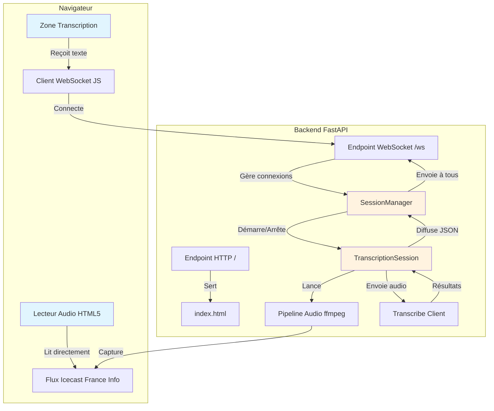

# Document de Design : Interface Web de Transcription

## Vue d'ensemble

Ce design décrit l'architecture d'une interface web pour le projet de transcription en temps réel de France Info. Le système réutilise la logique existante de capture audio (ffmpeg) et de transcription (Amazon Transcribe Streaming), en l'encapsulant dans un serveur FastAPI qui expose un endpoint WebSocket pour diffuser les résultats de transcription à une page web. Le frontend est une page HTML/JS unique servie par le backend, avec un lecteur audio `<audio>` pointant directement sur le flux Icecast et une zone de transcription alimentée par WebSocket.

### Décisions de design clés

1. **FastAPI** plutôt que Flask : support natif des WebSockets et de l'async, compatible avec le code existant basé sur `asyncio`.
2. **Session de transcription partagée** : un seul pipeline audio/transcription pour tous les clients connectés, afin de minimiser les coûts AWS.
3. **Audio joué par le navigateur** : le flux Icecast est lu directement par le tag `<audio>` HTML, sans passer par le backend. Le backend ne gère que la transcription.
4. **Frontend monofichier** : une seule page HTML avec CSS et JS intégrés, servie comme fichier statique par FastAPI. Pas de framework frontend.
5. **Affichage par diff incrémental** : les résultats partiels de Transcribe répètent tout le texte depuis le début du segment. Le frontend calcule le diff entre le partiel précédent et le nouveau, et n'affiche que les mots ajoutés. Cela produit un effet "mot après mot" fluide sans répétition. Si Transcribe corrige un mot (le nouveau partiel ne commence pas par l'ancien), la ligne courante est remplacée entièrement.

## Architecture



### Flux de données

1. Le navigateur ouvre la page et connecte le WebSocket à `/ws`
2. Le `SessionManager` détecte le premier client et démarre la `TranscriptionSession`
3. La `TranscriptionSession` lance ffmpeg pour capturer le flux Icecast → PCM 16kHz mono
4. L'audio PCM est envoyé au `TranscribeClient` via le SDK `amazon-transcribe`
5. Les résultats (partiels et finaux) sont sérialisés en JSON et diffusés à tous les clients WebSocket
6. En parallèle, le navigateur lit le flux audio directement via le tag `<audio>`

## Composants et Interfaces

### 1. `app.py` — Point d'entrée FastAPI

Responsabilités :
- Créer l'application FastAPI
- Monter le fichier statique `index.html` sur la route `/`
- Définir l'endpoint WebSocket `/ws`
- Gérer le cycle de vie de l'application (startup/shutdown)

```python
from fastapi import FastAPI, WebSocket, WebSocketDisconnect
from fastapi.responses import HTMLResponse
from pathlib import Path

app = FastAPI()

@app.get("/")
async def get_index():
    html_path = Path(__file__).parent / "static" / "index.html"
    return HTMLResponse(html_path.read_text())

@app.websocket("/ws")
async def websocket_endpoint(websocket: WebSocket):
    await websocket.accept()
    await session_manager.connect(websocket)
    try:
        while True:
            await websocket.receive_text()  # Maintient la connexion
    except WebSocketDisconnect:
        await session_manager.disconnect(websocket)
```

### 2. `session_manager.py` — Gestionnaire de sessions

Responsabilités :
- Maintenir la liste des clients WebSocket connectés
- Démarrer la transcription au premier client
- Arrêter la transcription quand le dernier client se déconnecte (avec délai de grâce)
- Diffuser les messages à tous les clients

```python
class SessionManager:
    def __init__(self):
        self.clients: list[WebSocket] = []
        self.transcription_session: TranscriptionSession | None = None
        self.grace_task: asyncio.Task | None = None

    async def connect(self, websocket: WebSocket) -> None:
        """Ajoute un client et démarre la transcription si nécessaire."""
        ...

    async def disconnect(self, websocket: WebSocket) -> None:
        """Retire un client et planifie l'arrêt si plus aucun client."""
        ...

    async def broadcast(self, message: dict) -> None:
        """Envoie un message JSON à tous les clients connectés."""
        ...

    async def _start_transcription(self) -> None:
        """Démarre une nouvelle session de transcription."""
        ...

    async def _schedule_stop(self) -> None:
        """Attend 30s puis arrête la transcription si aucun client."""
        ...
```

### 3. `transcription_session.py` — Session de transcription

Responsabilités :
- Gérer le pipeline audio ffmpeg (démarrage, arrêt, redémarrage)
- Gérer le client Amazon Transcribe Streaming
- Convertir les événements de transcription en messages structurés
- Appeler le callback de diffusion pour chaque résultat

```python
class TranscriptionSession:
    def __init__(self, on_message: Callable[[dict], Awaitable[None]]):
        self.on_message = on_message  # Callback pour diffuser les messages
        self.is_active: bool = False
        self._ffmpeg_process: subprocess.Popen | None = None
        self._audio_queue: asyncio.Queue = asyncio.Queue(maxsize=100)

    async def start(self) -> None:
        """Démarre le pipeline audio et la transcription."""
        ...

    async def stop(self) -> None:
        """Arrête proprement ffmpeg et la session Transcribe."""
        ...

    def _start_ffmpeg(self) -> None:
        """Lance le processus ffmpeg pour capturer le flux Icecast."""
        ...

    async def _feed_transcribe(self) -> None:
        """Lit la queue audio et envoie les chunks à Transcribe."""
        ...

    async def _handle_transcript_event(self, event) -> None:
        """Convertit un événement Transcribe en message et appelle on_message."""
        ...
```

### 4. `messages.py` — Modèles de messages

Responsabilités :
- Définir les structures de messages WebSocket
- Sérialiser/désérialiser les messages en JSON

```python
from dataclasses import dataclass, asdict
from datetime import datetime
import json

@dataclass
class TranscriptionMessage:
    type: str          # "partial" ou "final"
    text: str
    timestamp: str     # ISO 8601

@dataclass
class StatusMessage:
    type: str = "status"
    status: str = ""   # "connected", "transcribing", "error", "reconnecting"
    message: str = ""

def serialize(msg: TranscriptionMessage | StatusMessage) -> str:
    return json.dumps(asdict(msg))

def deserialize(raw: str) -> TranscriptionMessage | StatusMessage:
    data = json.loads(raw)
    if data.get("type") in ("partial", "final"):
        return TranscriptionMessage(**data)
    return StatusMessage(**data)
```

### 5. `static/index.html` — Frontend

Responsabilités :
- Afficher le lecteur audio pointant sur le flux Icecast
- Gérer la connexion WebSocket et la reconnexion automatique
- Afficher les résultats de transcription avec défilement automatique
- Afficher l'indicateur de statut de connexion

Structure HTML :
```html
<div id="app">
    <header>
        <h1>France Info — Transcription en direct</h1>
        <span id="status-indicator">● Déconnecté</span>
    </header>
    <audio id="player" controls src="http://icecast.radiofrance.fr/franceinfo-lofi.aac"></audio>
    <div id="transcription-zone">
        <!-- Les lignes de transcription apparaissent ici -->
        <p class="partial" id="current-line"></p>
    </div>
</div>
```

Logique JavaScript :
- Connexion WebSocket à `ws://localhost:8000/ws`
- Reconnexion automatique après 3 secondes en cas de déconnexion
- Traitement des messages JSON : mise à jour du texte partiel ou ajout d'une ligne finale
- Défilement automatique sauf si l'utilisateur a scrollé manuellement vers le haut
- **Algorithme de diff incrémental** : maintenir une variable `lastPartialText` contenant le dernier texte partiel affiché. Pour chaque nouveau partiel, vérifier si le nouveau texte commence par `lastPartialText`. Si oui, n'ajouter que le suffixe (les nouveaux mots). Si non (correction par Transcribe), remplacer la ligne courante entièrement. Pour un résultat final, calculer le diff avec le dernier partiel et ajouter le suffixe restant avant de figer la ligne.

## Modèles de données

### Messages WebSocket

#### Message de transcription
```json
{
    "type": "partial" | "final",
    "text": "Le texte transcrit...",
    "timestamp": "2024-01-15T14:30:00.123Z"
}
```

#### Message de statut
```json
{
    "type": "status",
    "status": "connected" | "transcribing" | "error" | "reconnecting",
    "message": "Description lisible de l'état"
}
```

### État du SessionManager

| Champ | Type | Description |
|-------|------|-------------|
| `clients` | `list[WebSocket]` | Clients WebSocket actuellement connectés |
| `transcription_session` | `TranscriptionSession \| None` | Session active ou None |
| `grace_task` | `asyncio.Task \| None` | Tâche de délai de grâce en cours |

### État de la TranscriptionSession

| Champ | Type | Description |
|-------|------|-------------|
| `is_active` | `bool` | Indique si la session est en cours |
| `_ffmpeg_process` | `Popen \| None` | Processus ffmpeg en cours |
| `_audio_queue` | `asyncio.Queue` | File d'attente des chunks audio PCM |
| `on_message` | `Callable` | Callback de diffusion des messages |

### Configuration

```python
STREAM_URL = "http://icecast.radiofrance.fr/franceinfo-lofi.aac"
LANGUAGE_CODE = "fr-FR"
SAMPLE_RATE = 16000
REGION = "us-east-1"
HOST = "127.0.0.1"  # Écoute locale uniquement
PORT = 8000
GRACE_PERIOD_SECONDS = 30
RECONNECT_DELAY_SECONDS = 5
```


## Propriétés de Correction

*Une propriété est une caractéristique ou un comportement qui doit rester vrai pour toutes les exécutions valides d'un système — essentiellement, une déclaration formelle sur ce que le système doit faire. Les propriétés servent de pont entre les spécifications lisibles par l'humain et les garanties de correction vérifiables par la machine.*

### Property 1 : Aller-retour de sérialisation des messages

*Pour tout* message de transcription valide (TranscriptionMessage ou StatusMessage), sérialiser le message en JSON puis désérialiser le JSON résultant doit produire un objet équivalent au message original.

**Validates: Requirements 5.4, 5.5, 5.6**

### Property 2 : Structure des messages de transcription

*Pour tout* événement de transcription (partiel ou final) produit par le Transcribe_Client, le message JSON résultant envoyé via WebSocket doit contenir exactement les champs `type` (valeur "partial" ou "final"), `text` (chaîne non vide) et `timestamp` (format ISO 8601 valide).

**Validates: Requirements 3.2, 3.3, 5.1**

### Property 3 : Structure des messages de statut

*Pour tout* message de statut généré par le Backend, le message JSON doit contenir exactement les champs `type` (valeur "status"), `status` (une des valeurs "connected", "transcribing", "error", "reconnecting") et `message` (chaîne de caractères).

**Validates: Requirements 5.2**

### Property 4 : Validation des messages — rejet sans champ type

*Pour tout* message JSON reçu par le Frontend qui ne contient pas de champ `type`, le désérialiseur doit lever une erreur ou retourner un résultat invalide, et le message ne doit pas être traité.

**Validates: Requirements 5.3**

### Property 5 : Unicité de la session de transcription

*Pour tout* ensemble de N clients WebSocket connectés simultanément (N ≥ 1), le SessionManager doit maintenir exactement une seule TranscriptionSession active.

**Validates: Requirements 4.1**

### Property 6 : Diffusion des erreurs à tous les clients

*Pour toute* erreur survenant dans le Pipeline_Audio ou le Transcribe_Client, et pour tout ensemble de clients WebSocket connectés, chaque client doit recevoir un message de statut avec `status` = "error".

**Validates: Requirements 4.4, 4.5**

### Property 7 : Horodatage dans le rendu des lignes finales

*Pour tout* message de transcription final avec un horodatage donné, le HTML généré pour cette ligne doit contenir cet horodatage sous forme lisible.

**Validates: Requirements 7.4**

### Property 8 : Affichage incrémental sans répétition

*Pour toute* séquence de résultats partiels P(1), P(2), ..., P(n) où chaque P(i+1) est un préfixe étendu de P(i) (c'est-à-dire P(i+1) commence par P(i)), le texte total affiché dans la Zone_Transcription doit être exactement P(n) — sans aucune répétition de sous-chaîne.

**Validates: Requirements 6.1, 6.2, 6.4**

## Gestion des erreurs

| Scénario | Comportement | Exigence |
|----------|-------------|----------|
| Flux Icecast indisponible (ffmpeg échoue) | Le Backend envoie un message `status: "error"` à tous les clients, journalise l'erreur, et tente un redémarrage après 5 secondes | 4.4 |
| Erreur Amazon Transcribe | Le Backend envoie un message `status: "error"`, journalise l'erreur, et redémarre la session de transcription | 4.5 |
| Connexion WebSocket perdue (côté client) | Le Frontend affiche "Déconnecté", tente une reconnexion après 3 secondes | 3.6 |
| Port déjà utilisé au démarrage | Le Backend affiche un message d'erreur clair et s'arrête | 1.3 |
| Signal SIGINT/SIGTERM | Le Backend ferme ffmpeg, la session Transcribe, et toutes les connexions WebSocket proprement | 4.3 |
| Message JSON invalide reçu par le Frontend | Le Frontend ignore le message silencieusement | 5.3 |
| Queue audio pleine | Les anciens chunks sont supprimés pour faire place aux nouveaux (comportement existant) | — |

### Stratégie de redémarrage

Le Backend utilise une stratégie de redémarrage simple avec backoff :
- Premier redémarrage : après 5 secondes
- Si le redémarrage échoue, les clients restent notifiés avec `status: "error"`
- Le redémarrage est tenté à chaque nouvelle connexion client

## Stratégie de tests

### Approche duale

Les tests combinent deux approches complémentaires :

1. **Tests unitaires** : vérifient des exemples spécifiques, des cas limites et des conditions d'erreur
2. **Tests de propriétés** : vérifient des propriétés universelles sur un large éventail d'entrées générées

### Bibliothèque de tests de propriétés

- **Hypothesis** pour Python (backend) — bibliothèque PBT mature pour Python
- Chaque test de propriété doit exécuter au minimum 100 itérations
- Chaque test doit référencer la propriété du design qu'il valide

### Tests unitaires (pytest)

| Test | Description | Exigence |
|------|-------------|----------|
| `test_index_served` | Vérifie que GET `/` retourne du HTML | 1.1 |
| `test_websocket_connect_starts_session` | Vérifie qu'une connexion WS démarre la transcription | 3.1 |
| `test_grace_period_stops_session` | Vérifie l'arrêt après déconnexion du dernier client + 30s | 4.2 |
| `test_partial_message_updates_current_line` | Vérifie le comportement JS pour les résultats partiels | 3.4 |
| `test_final_message_creates_new_line` | Vérifie le comportement JS pour les résultats finaux | 3.5 |
| `test_status_indicator_present` | Vérifie la présence de l'indicateur de statut dans le HTML | 6.1 |

### Tests de propriétés (Hypothesis)

| Test | Propriété | Tag |
|------|-----------|-----|
| `test_message_round_trip` | Property 1 : Aller-retour sérialisation | Feature: web-transcription-ui, Property 1: Message serialization round trip |
| `test_transcription_message_structure` | Property 2 : Structure messages transcription | Feature: web-transcription-ui, Property 2: Transcription message structure |
| `test_status_message_structure` | Property 3 : Structure messages statut | Feature: web-transcription-ui, Property 3: Status message structure |
| `test_reject_missing_type` | Property 4 : Rejet messages sans type | Feature: web-transcription-ui, Property 4: Reject messages without type |
| `test_single_session` | Property 5 : Unicité session | Feature: web-transcription-ui, Property 5: Single shared session |
| `test_error_broadcast` | Property 6 : Diffusion erreurs | Feature: web-transcription-ui, Property 6: Error broadcast to all clients |
| `test_final_line_timestamp` | Property 7 : Horodatage lignes finales | Feature: web-transcription-ui, Property 7: Final line timestamp rendering |
| `test_incremental_display_no_repetition` | Property 8 : Affichage incrémental sans répétition | Feature: web-transcription-ui, Property 8: Incremental display no repetition |

### Structure des fichiers de test

```
tests/
├── test_messages.py          # Property 1, 2, 3, 4 + tests unitaires messages
├── test_session_manager.py   # Property 5, 6 + tests unitaires lifecycle
└── test_frontend.py          # Property 7, 8 + tests unitaires UI
```
